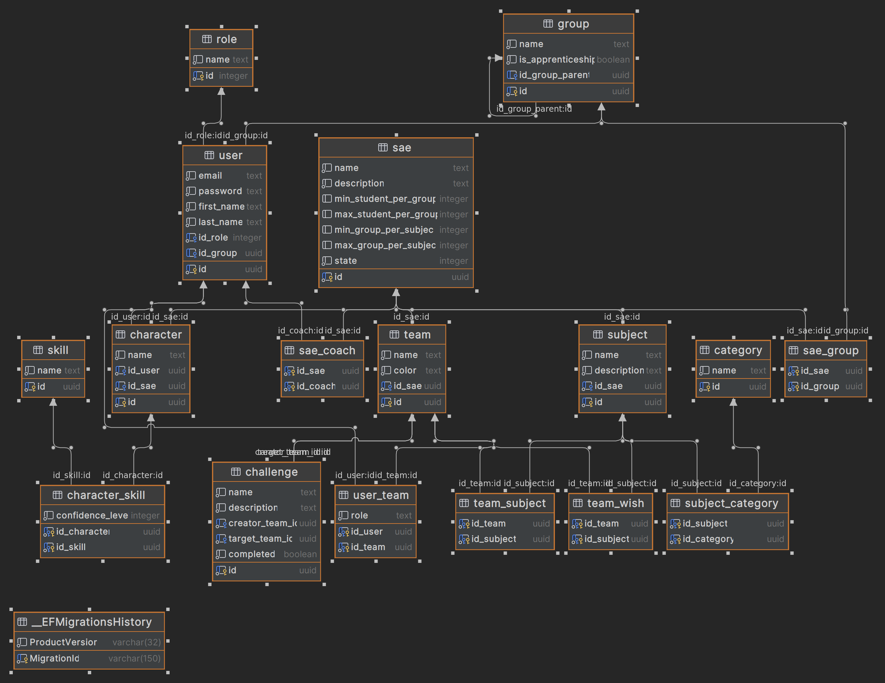

<h1>Ceci est la documentation technique du backend</h1>
La documentation technique du front end se trouve [ici](./doc-front.md)

# Sommaire
- [Sommaire](#sommaire)
- [Technologies utilisés](#technologies-utilisés)
- [Installation et utilisation](#installation-et-utilisation)
  - [Méthode docker:](#méthode-docker)
- [Architecture du code](#architecture-du-code)
- [Schéma de la base de données](#schéma-de-la-base-de-données)

# Technologies utilisés


  Api:

    Asp net 7.0

  BD:

    PostgresDB

# Installation et utilisation

## Méthode docker:

Faites un git clone du projet

Placez vous la ou se trouve le fichier docker-compose.yml

exécuter la commande:

  docker compose up -d

Pour modifier les settings de connection à la bd Postgres on peut changer les variables d'environnement présentes dans le `docker-compose.yaml`

    environment:
        - ConnectionStrings__DatabaseConnection=Server=db;Port=5432;Database=postgres;Username=postgres;Password=postgres

et:

    environment:
        POSTGRES_PASSWORD: postgres
        POSTGRES_USER: postgres
        POSTGRES_DB: postgres


# Architecture du code


```yaml
backend
    ├───ApiModels
    │   └───Output
    ├───Controllers
    ├───Data
    │   └───Models
    ├───FormModels
    ├───Migrations
    ├───Properties
    ├───Services
    │   ├───Class
    │   └───Interfaces
    └───Utils
```

Dans `Data/Models` on trouve les classes qui vont être stockées dans la base de données. Dans `Data` on trouve EntityContext.cs qui gère la connexion et la déclaration de ces tables dans la base de données.

Dans `FormModels` on trouve les classes qu'on à crées qui déclarent les types de données attendues à la réception et/ou à l'envoi

Dans `Controllers` on déclare les controllers pour chaque type de donnée. Dans eux on déclare les routes et on valide le contenu du formulaire. Par contre on ne fait pas les requêtes dans ces classes. On les fait dans 
`Services/Class` chacune des classes dedans implémente l'interface déclarée dans `Services/Interface`.

Dans `Utils/RoleAccesses.cs` on déclare les différents rôles et leurs permissions héritées.

Dans `Controllers/AuthController.cs` la logique de authentification à lieu. (Création des token Jwt)

# Schéma de la base de données




