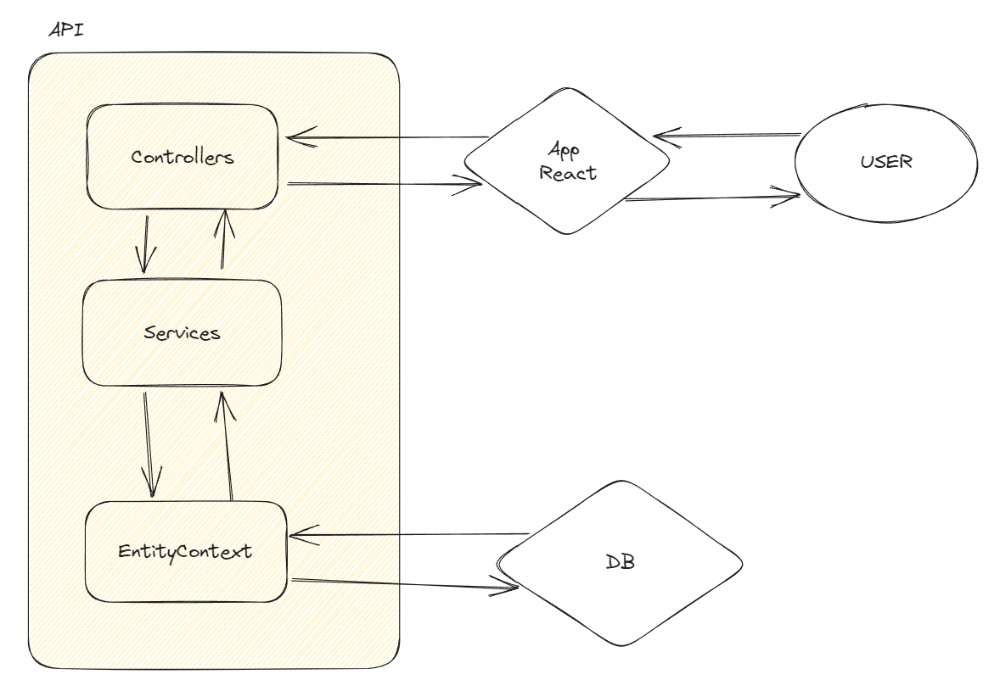

<h1>Ceci est la documentation technique du backend</h1>
La documentation technique du front end se trouve [ici](./doc-front.md)

# Sommaire
- [Sommaire](#sommaire)
- [Technologies utilisés](#technologies-utilisés)
- [Installation et utilisation](#installation-et-utilisation)
  - [Méthode docker:](#méthode-docker)
- [Architecture du code](#architecture-du-code)
- [Schéma de la base de données](#schéma-de-la-base-de-données)

# Technologies utilisés


  Api:

    Asp net 7.0

  BD:

    PostgresDB

# Installation et utilisation

## Méthode docker:

Prérequis:
- [Docker](https://docs.docker.com/get-docker/)

Cloner le projet
```bash
git clone git@github.com:IUT-Blagnac/sae-5-1-01-phase4-c-react.git
cd sae-5-1-01-phase4-c-react
```

exécuter la commande:
```bash
docker compose up -d --build
```

Pour modifier les settings de connection à la bd Postgres on peut changer les variables d'environnement présentes dans le `docker-compose.yaml`

    environment:
        - ConnectionStrings__DatabaseConnection=Server=db;Port=5432;Database=postgres;Username=postgres;Password=postgres

et:

    environment:
        POSTGRES_PASSWORD: postgres
        POSTGRES_USER: postgres
        POSTGRES_DB: postgres

# Architecture globales du projet



# Architecture du code


```yaml
backend
    ├───ApiModels
    │   └───Output
    ├───Controllers
    ├───Data
    │   └───Models
    ├───FormModels
    ├───Migrations
    ├───Properties
    ├───Services
    │   ├───Class
    │   └───Interfaces
    └───Utils
```

Dans le dossier `Data/Models` on trouve les classes qui vont être stockées dans la base de données. Dans `Data` on trouve EntityContext.cs qui gère la connexion et la déclaration de ces tables dans la base de données.

Dans le fichier ``Data/Models/EntityContext.cs`` on trouve la déclaration des tables et des relations entre elles avec les différentes clé primaires et étrangères.

Dans le dossier `FormModels` on trouve les classes qu'on à crées qui déclarent les types de données attendues à la réception et/ou à l'envoi

Dans le dossier `Controllers` on déclare les controllers pour chaque type de donnée. Dans eux on déclare les routes et on valide le contenu du formulaire. Par contre on ne fait pas les requêtes dans ces classes. On les fait dans 
`Services/Class` chacune des classes dedans implémente l'interface déclarée dans `Services/Interface`.

Dans `Utils/RoleAccesses.cs` on déclare les différents rôles et leurs permissions héritées.

Dans `Controllers/AuthController.cs` la logique de authentification à lieu. (Création des token Jwt)

Dans le dossier `Services` nous retrouvons les classes permettant de faire les différentes requête à la base de données. Chaque classe implémente une interface déclarée dans le dossier `Services/Interfaces`.

Dans le dossier `ApiModels/Output` on retrouve les classes qui déclarent les données qui seront renvoyées par l'api.

# Schéma de la base de données


