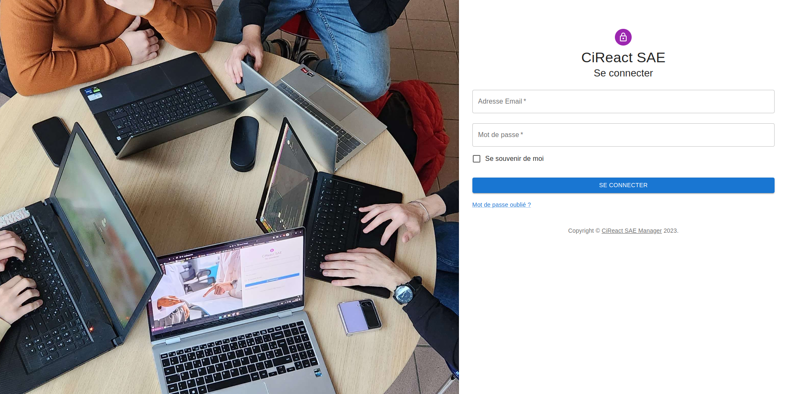
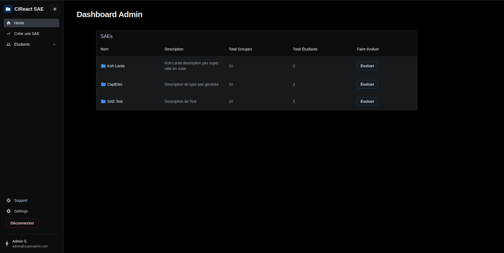
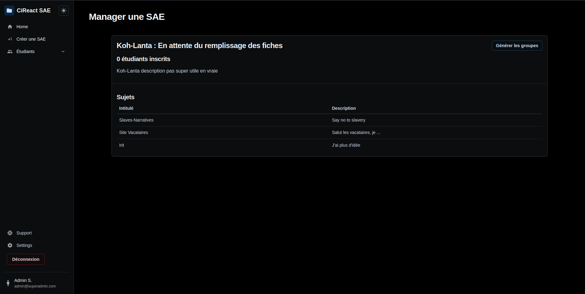
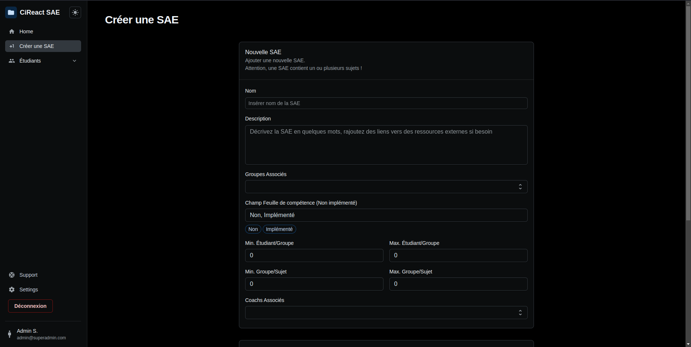
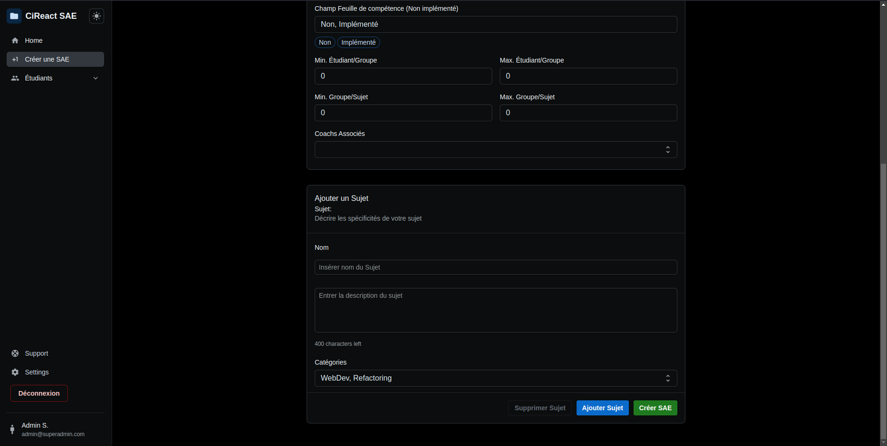
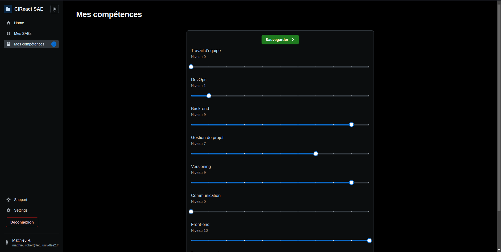

# Documentation Utilisateur

## Introduction

Ce présent document a pour but de présenter les fonctionnalités de l'application et de guider l'utilisateur dans son utilisation.

## Sommaire

- [Présentation de l'application](#présentation-de-lapplication)
- [Note importante](#note-importante)
- [Documentation Utilisateur - Commun](#documentation-utilisateur---commun)
  - [Dark Mode](#dark-mode)
  - [Page de connexion](#page-de-connexion)
  - [Support](#support)
- [Documentation Administrateur](#documentation-administrateur)
  - [Dashboard](#dashboard)
  - [Manage SAE](#manage-sae)
  - [Créer une SAE](#créer-une-sae)
  - [Importer des utilisateurs](#importer-des-utilisateurs)
- [Documentation Etudiant](#documentation-etudiant)
  - [Fiche de compétences](#fiche-de-compétences)
  - [Consulter SAE](#consulter-sae)
- [Documentation Professeur](#documentation-professeur)
  - [Consulter SAE Professeur](#consulter-sae-professeur)
  - [Noter SAE](#noter-sae)

## Présentation de l'application

L'application est une application de gestion de SAE. Elle permet de créer des SAE, d'y ajouter des groupes, lancer des challenges ...

## Note importante

1. L'application est en cours de développement, certaines fonctionnalités ne sont pas encore implémentées.

2. Certaines features sont prêtes à être implémentées sur l'interface utilisateur, or l'ordinateur du développeur front a grillé à la fin du projet. Il n'a donc pas pu les implémenter.

3. La lecture de la documentation du backend est fortement recommandée pour une meilleure compréhension de l'application au dela de l'interface.

## Documentation Utilisateur - Commun

### Dark Mode

L'application est disponible en mode sombre. Pour cela, il suffit de cliquer sur le bouton en haut à gauche de l'application pour faire la bascule.

### Page de connexion



La page de connexion permet de se connecter à l'application. Pour cela, il faut renseigner son adresse mail et son mot de passe.

Compte Administrateur :

- Email : <admin@superadmin.com>
- Mot de passe : `isfqzA8@&Ne@y9Ls@9CK`

Compte Etudiant :

- Email : <matthieu.robert@etu.univ-tlse2.fr>
- Mot de passe : `6@ANdqS$x@er&76khmkJ`

En cas de mot de passe incorrect, un message d'erreur s'affiche.

### Support

Trouvable dans la Sidebar, le support répértorie un rappel avec explication des différents états d'une SAE, et un lien vers la documentation utilisateur. Pour les étudiants, un formulaire fonctionnel permet de contacter l'administrateur en cas de problème par mail.

## Documentation Administrateur

### Dashboard



L'administrateur a accès à un dashboard qui lui permet de voir la totalité des SAE dans une vue globale. Il retrouve le nom des SAEs, la description, le nombre de groupes, le nombre d'étudiants, et un bouton pour pouvoir faire évoluer la SAE.

### Manage SAE



En cliquant sur le bouton "Evoluer", l'administrateur arrive sur une page qui lui permet de gérer la SAE. L'entièreté de l'affichage est dynamique permettant d'avoir une interface changeante en fonction de l'état de la SAE.
Il peut alors basculer entre les différents états de la SAE, et ainsi faire évoluer la SAE.

Une SAE peut avoir 5 états :

- En attende du remplissage des fiches : La SAE vient d'être créée, l'administrateur attend que les étudiants remplissent leurs fiches de compétences.

- En attente des voeux : Les étudiants ont rempli leurs fiches de compétences, les groupes se sont créés de manière optimisée et automatique. L'administrateur attend que les étudiants fassent leurs voeux de sous-sujet.

- Lancée : Les étudiants ont un groupe, un sujet attribué, les étudiants peuvent commencer à travailler sur leur sujet et se lancer des challenges.

- Lancée, ouverte pour les alternants : Les alternants peuvent rejoindre la SAE et participer aux challenges. _(Non implémenté sur l'interface)_

- Terminée : La SAE est terminée, les étudiants ne peuvent plus se lancer de challenges, et les professeurs peuvent commencer à noter les étudiants.

### Créer une SAE




L'administrateur peut créer une SAE en cliquant sur le bouton "Créer une SAE" présent sur la sidebar. Il peut alors créer une SAE avec plusieurs valeurs paramétrables à souhait :

- Le nom de la SAE
- La description de la SAE
- Les groupes pouvant accéder à la SAE
- La taille minimum des groupes
- La taille maximum des groupes
- Le nombre minimum de groupes à générer
- Le nombre maximum de groupes à générer
- Des catégories pour représenter au mieux la SAE
- Des professeurs pour encadrer la SAE
- Les sous sujets de la SAE
- - Création d'autant de sujet que l'on souhaite
- - Nom du sujet
- - Description du sujet
- - Possibilité plus tard d'y ajouter d'autres champs (ex: image, lien, ...)

_Le formulaire renvoie un message de succès ou d'erreur en fonction de la réussite de la création de la SAE._

### Importer des utilisateurs

L'administrateur peut importer des groupes classes à l'aide d'un fichier csv ou json. Pour cela il suffit de se diriger dans la sidebar ouvrir le menu "Utilisateur" qui donnera accès à l'option "Importer des utilisateurs".
Il pourra alors envoyer un fichier csv ou json contenant les informations des utilisateurs à importer (email, nom, prénom, groupe) et le système s'occupera de les ajouter en base, avec un mot de passe par défaut.

Exemple de fichier csv :

```csv
FirstName,LastName,Email
eric,philippe,eric@msn.fr
loan,gayrard,loan@orange.fr
matthieu,robert,matthieu@hotmail.fr
hugo,castell,hugo@test.be
toma,testa,toma@webetud.io
```

## Documentation Etudiant

### Fiche de compétences



L'étudiant peut accéder à sa fiche de compétences en cliquant sur le bouton "Fiche de compétences" présent sur la sidebar. Il peut alors remplir sa fiche de compétences en fonction de ses compétences. Il peut également modifier et consulter sa fiche de compétences à tout moment.

> _Note : Nous avons fait le choix de faire une fiche de compétence commune pour toutes les SAEs par soucis de temps. Pour autant, la base de données est prête à accueillir une fiche de compétence par SAE._

### Consulter SAE

L'étudiant peut consulter les SAEs disponibles pour lui depuis la Dashboard. En cliquant sur celle de son choix, au même titre qu'un administrateur, il peut consulter les informations de la SAE en fonction de son état.

Dans l'étape "En attente du remplissage des fiches", l'étudiant peut consulter les informations de la SAE, à savoir la SAE en général et ses sous-sujets.
A l'étape "En attente des voeux", l'étudiant peut consulter les informations de la SAE, à savoir la SAE en général, ses sous-sujets, et le groupe dans lequel il se trouve. Il peut alors faire ses voeux de sous-sujets.
A l'étape "Lancée", l'étudiant peut consulter les informations de la SAE, à savoir la SAE en général, ses sous-sujets, le groupe dans lequel il se trouve, et le sujet qui lui a été attribué. Il peut alors consulter les informations du sujet, et lancer des challenges aux équipes ayant le même sujet que lui.

## Documentation Professeur

> Note: Les professeurs n'ont pas pu être implémentés sur l'interface, mais la base de données est prête à les accueillir. Le texte suivant est donc une explication de ce qui est prévu pour eux.

### Consulter SAE Professeur

Le professeur peut consulter les SAEs disponibles pour lui depuis la Dashboard. En cliquant sur celle de son choix, au même titre qu'un administrateur, il peut consulter les informations de la SAE en fonction de son état.

### Noter SAE

Page remplaçant la page de consultation de la SAE pour les professeurs lorsqu'elle est au stade "Terminée". Le professeur peut alors consulter les informations de la SAE, à savoir la SAE en général, ses sous-sujets, les groupes, les étudiants, et les challenges lancés par les étudiants. Il peut alors noter les étudiants en fonction des challenges qu'ils ont réalisés.
